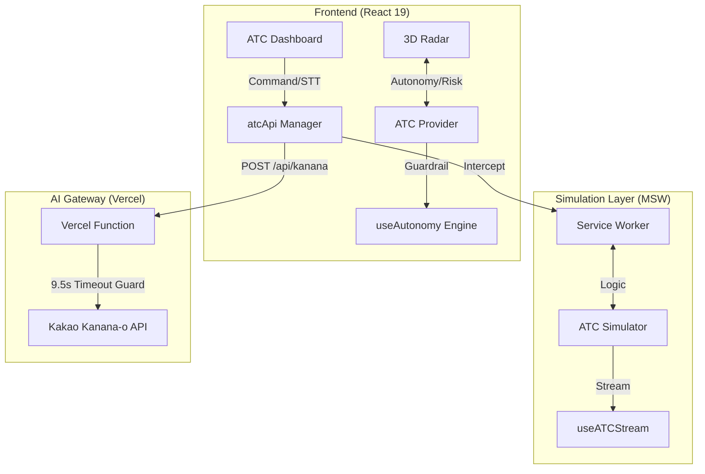

# 🛰️ Kanana ATC (Agent Traffic Control)

<p align="center">
  
  
  
  
  
</p>

> **"비결정적인 AI의 판단을 확정적인 시스템 제어로 연결하는 지능형 관제 커널"**
> 본 프로젝트는 카카오 **Kanana 429 앰배서더** 활동의 기술 실증 사례입니다. 실시간 데이터 스트림 속에서 AI가 상황을 **인지**하고, 전술적 **판단**을 내려, 실제 시스템 명령으로 **실행**하는 에이전틱 관제 시스템의 핵심 메커니즘을 구현했습니다.

---

## 🚀 Core Engines (The Brain)

### 1. 🔄 실시간 동기화 및 스트림 엔진
서버의 물리적 상태와 클라이언트 UI를 완벽하게 일치시키는 핵심 브레인입니다.
* **Field Locking Mechanism**: 관제사가 이름 변경(Rename) 시, 서버 데이터가 갱신되어 내려오기 전까지 **5초간(expiry) 클라이언트 값을 강제 유지**하여 네트워크 지연으로 인한 '데이터 롤백(깜빡임)' 현상을 차단합니다.
* **RAF-based Batching**: SSE 스트림 데이터를 브라우저 주사율(**requestAnimationFrame**)에 맞춰 배치 처리하여 저사양 기기에서도 60fps의 매끄러운 3D 시각화를 보장합니다.
* **Zero-Infra Simulation**: **MSW(Mock Service Worker)**를 통해 실제 운영 환경의 `FencedLock` 메커니즘을 브라우저 내에서 완벽히 재현하여 인프라 비용 없이 고도의 분산 로직을 검증합니다.

### 2. 🧠 전략적 사고 엔진 (`Kanana-o AI`)
단순 응답기가 아닌, 시스템 제어권을 가진 전략적 관제 AI 페르소나입니다.
* **Cognitive Structure**: 모든 응답을 `<THOUGHT>`(추론), `<PREDICTION>`(예측), `<REPORT>`(브리핑) 단계로 구분하여 출력하는 사고 체계를 갖췄습니다.
* **Transactional Action Tags**: `[ACTION:COMMAND:TARGET:VALUE]` 규격을 통해 분석부터 **12종의 시스템 명령 실행권**까지 동시에 확보합니다.
* **Adaptive ID Resolver**: AI가 UUID 대신 에이전트의 `displayName`으로 명령을 내려도 시스템이 이를 실시간 매칭하여 실행하는 유연한 식별 로직을 탑재했습니다.

### 3. 🛡️ 자율성 및 안전 가드레일
AI의 오작동을 방지하고 시스템 안정성을 유지하는 다층적 보호막입니다.
* **Weighted Risk Scoring**: 기체 부하(70% 임계치), 지연시간(100ms), 밀도를 가중치 합산하여 **실시간 위험 지수(0-100)**를 산출합니다.
* **Trend Analysis (Delta Check)**: 조치 후 리스크 점수의 기울기(Slope)를 분석하여 상황 악화 시 즉시 **EARLY_EXIT 및 수동 모드(Handover)**로 강제 전환합니다.
* **Dynamic Autonomy Level**: 리스크에 따라 자율 주행 레벨을 가변 운영하여 인간과 AI의 주도권을 유연하게 조율합니다.

---

## 📊 Operational Interface (UI/UX)

* **Tactical Radar (3D)**: Three.js(R3F) 기반 입체 관제 환경. `lerp` 기반 오토 트래킹과 AI 제안 기체에 대한 **Sky-blue Pulse** 강조 효과를 지원합니다.
* **Command Center (STT)**: 텍스트 및 **Web Speech API** 기반 음성 명령을 지원하며, 사이드바 Brain 토글 시 AI 개입 상태를 실시간 시각화합니다.
* **Draggable HUD**: `react-draggable`이 적용된 부유형 컨트롤러를 통해 관제사 개인별 최적화된 레이아웃 구성이 가능합니다.
* **Semantic Audio Insight**: Sine(성공), Square(중지), Sawtooth(경고) 파형 설계를 통해 화면을 보지 않고도 시스템 상태 변화를 직관적으로 인지합니다.

---

## 🎬 Demo Scenarios (Powered by Kanana-o)

### Scenario 1: Multimodal Crisis Response (멀티모달 위기 대응)
단순 텍스트를 넘어 **시각적 데이터**를 활용한 에이전트 제어 시뮬레이션입니다.
* **동작:** 관제 화면(3D Radar) 캡처본이나 현장 사고 이미지를 첨부하여 "현재 상황을 해결해"라고 명령합니다.
* **결과:** Kanana-o AI가 이미지를 분석해 위험 에이전트를 식별하고, 즉각적으로 `[ACTION:PAUSE]` 또는 `[ACTION:ISOLATE]` 등의 전략적 제안을 렌더링합니다.

### Scenario 2: Real-time Audio Briefing & Auto-Pilot (실시간 음성 브리핑 및 자율 관제)
AI가 스스로 판단하고 행동하는 **Agentic Workflow** 시연입니다.
* **동작:** 대규모 트래픽 잼(Traffic Jam) 발생 시 오토파일럿(Autopilot) 모드를 활성화합니다.
* **결과:** Kanana API에서 수신되는 PCM 오디오 스트림을 통해 지연 없는 실시간 음성 브리핑이 재생되며, 관제사의 승인 없이도 AI가 `SCALE`, `TRANSFER` 명령을 3D 레이더 뷰에 즉시 반영합니다.

### Scenario 3: Risk Haptic & Privacy Shield (위험 감지 및 프라이버시 보호)
시스템의 안전성과 보안 가드레일을 검증하는 시나리오입니다.
* **동작:** 1) PII(주민번호, 연락처 등)가 포함된 텍스트를 입력하거나, 2) 시스템 부하가 극심한 상황을 연출합니다.
* **결과:** 내부 프라이버시 필터가 민감 정보를 `***`로 마스킹하여 AI에게 전달합니다. 또한 AI가 Risk Level 8 이상의 치명적 위험을 감지하면 즉시 화면에 강렬한 붉은색 시각적 햅틱(Visual Haptic) 경고를 발생시킵니다.

---

## 🏗️ Architecture



> **Note**: 보안 정책상 `KANANA_API_KEY` 보호를 위해 클라이언트가 직접 카카오 서버와 통신하지 않고, Vercel Serverless Function을 프록시로 활용하여 안전하게 통신합니다.

---

## 📦 Installation & Setup

### Quick Start
```bash
# Clone the repository
git clone https://github.com/209512/kanana-atc.git
cd kanana-atc

# Install & Run
npm install
npm run dev
```
* **Local URL**: http://localhost:5173
* **Live Demo**: [배포된 Vercel 주소 입력]

---

## 🛠️ Technical Stack

| Component | Technology | Description |
| --- | --- | --- |
| **Frontend** | React 19, Vite 7, TypeScript | Modern UI & High-speed bundling |
| **3D Rendering** | Three.js, R3F, Drei | Tactical 3D drone radar visualization |
| **AI Engine** | Kakao Kanana-o | Strategic decision & PCM Audio briefing |
| **Simulation** | MSW 2.x | Zero-infra distributed logic simulation |
| **Infrastructure** | Vercel | Secure API Proxy & Secret management |

---

## 📝 Expert Insight
본 프로젝트는 비결정적인 AI의 판단을 확정적인 시스템 제어로 연결하는 **'인지적 관제 커널'**의 가능성을 증명합니다. 단순한 챗봇을 넘어, 초단위로 변화하는 실시간 데이터 스트림 속에서 AI가 어떻게 '행동'하고 '책임'져야 하는지에 대한 기술적 해답을 제시합니다.

---

## 📝 License
Copyright 2026 **209512**. Licensed under the **Apache License, Version 2.0**. See the [LICENSE](./LICENSE) file for details.
