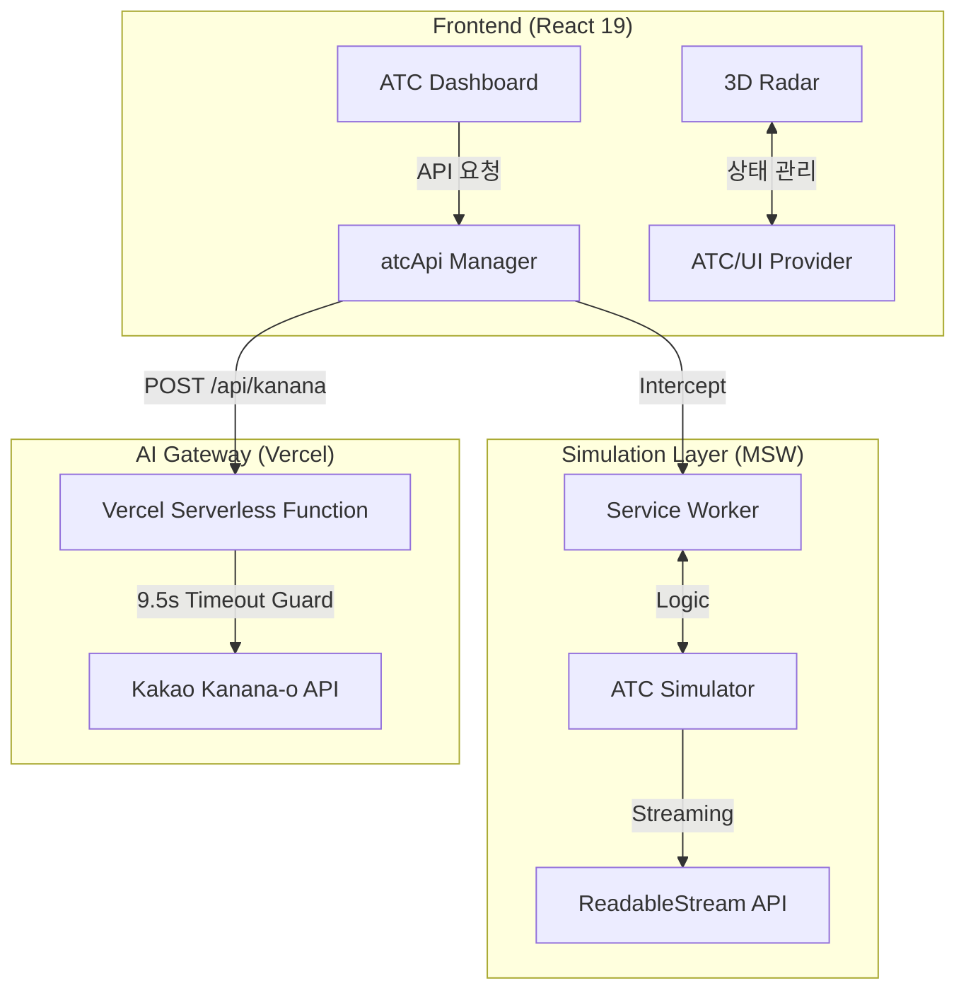

# 🛰️ Kanana ATC (Agent Traffic Control)


> **본 프로젝트는 카카오 Kanana 429 앰배서더 활동의 기록이자 기술 실험의 결과물입니다.**

**Kanana ATC**는 카카오의 멀티모달 AI **Kanana-o**를 위한 고성능 에이전트 관제 및 인지 최적화 **테스트베드**입니다. 

기존의 복잡한 분산 시스템 인프라(Hazelcast, Node.js) 의존성을 제거하고, **MSW(Mock Service Worker)** 기반의 Standalone 아키텍처로 재설계되었습니다. 이를 통해 일일 호출 제한(Quota) 환경에서도 실제 운영 환경과 동일한 데이터 흐름을 재현하며, AI 에이전트의 리소스 경합 상황을 시각화하고 제어합니다.

---

## 🚀 Key Features

### 1. 3D Tactical Radar (Three.js / R3F)
* **Real-time Visualization**: 에이전트들이 중앙 리소스를 중심으로 궤도 비행을 하며 관제 상태를 실시간 3D 환경으로 시각화합니다.
* **Smart Camera System**: `lerp` 기반의 부드러운 트래킹(Auto-tracking)과 사용자의 수동 조작(`OrbitControls`)이 매끄럽게 동기화되어 관제 편의성을 극대화합니다.
* **Visual Feedback**:
    * **Green Beam**: Active Lock Holder (Kanana-o 모델이 자원을 점유하여 처리 중인 상태).
    * **Purple Pulse**: Force Seize / Hostile Takeover (강제 권한 회수 진행 중).
    * **Gray/Red Pulse**: Paused / Suspended (일시 중단된 에이전트).

### 2. Standalone Hybrid Architecture
* **Zero-Infra Simulation**: MSW를 통해 실제 운영 환경의 `FencedLock` 메커니즘과 SSE(Server-Sent Events) 스트리밍을 브라우저 내에서 완벽히 재현했습니다.
* **Event-Driven AI Intervention**: 모든 순간에 API를 소모하지 않고, 데드락이나 병목 징후 포착 시에만 Kanana-o가 개입하여 문제를 해결하는 전략적 관제 로직을 지향합니다.

### 3. Tactical Audio & Insight Monitoring
* **Hybrid Audio Strategy**: 
    * **Cloud**: 응답 지연을 방지하기 위해 **Text-only** 모드로 동작하며, 10초 이내의 초저지연 관제 브리핑을 보장합니다.
    * **Local**: 카나나 API 고유의 **PCM(24kHz) 오디오 파이프라인**을 지원하여, 개발 환경에서 AI 음성 출력이 가능합니다.
* **AI Link Hub**: 사이드바의 Brain 토글 시, 중앙 허브가 `KANANA-O`로 변하며 AI 개입 상태를 실시간 시각화합니다.
* **Tactical Terminal**: 가상 스크롤링 기반의 고성능 터미널에서 `AI_INSIGHT` 로그만 필터링하는 전용 HUD 모드를 제공합니다.

---

## 💡 Why Kanana-o for ATC?
* **초저지연(Low-latency) 응답**: 실시간 교통 제어 및 관제에 필수적인 빠른 피드백 루프를 제공합니다.
* **멀티모달 인지**: 레이더 스냅샷(이미지)과 상황 로그(텍스트)를 동시에 파악하여 인간 관제사 수준의 판단력을 제공합니다.

---

## 🎬 Demo Scenarios

### Scenario 1: The Hostile Takeover (Force Seize)
관리자가 에이전트의 권한을 강제로 회수하고 에이전트에게 권한을 할당하는 시나리오입니다. 대상 에이전트가 **Purple**로 점멸하며 즉각적으로 권한을 획득하는 과정을 시뮬레이션합니다.


### Scenario 2: VIP Fast-Track (Priority Injection)
특정 에이전트에게 VIP 권한(Star badge)을 부여하여 대기열(Standard Queue)을 우회하고 우선순위 스택(Priority Stack)으로 즉시 진입시키는 테스트입니다.


### Scenario 3: Autonomous Tracking (Smart Focus)
보내주신 `CameraController` 로직이 적용된 기능입니다. 특정 에이전트를 클릭 시 카메라가 부드럽게 추적을 시작하며, 사용자가 마우스로 개입하는 즉시 수동 제어로 전환되는 Seamless UX를 실험합니다.


---

## 🏗️ Architecture



> **Note**: 보안 정책상 `KANANA_API_KEY` 보호를 위해 클라이언트가 직접 카카오 서버와 통신하지 않고, Vercel Serverless Function을 프록시로 활용하여 안전하게 통신합니다.

---

## 📦 Installation & Setup

### Quick Start
```bash
# Clone the repository
git clone https://github.com/209512/kanana-atc.git
cd kanana-atc

# Install & Run
npm install
npm run dev
```
* **Local URL**: http://localhost:5173
* **Live Demo**: [버셀 배포 주소]

---

## 🛠️ Technical Stack

| Component | Technology | Description |
| --- | --- | --- |
| **Frontend** | React 19, Vite 7, TypeScript | Modern UI & High-speed bundling |
| **3D Rendering** | Three.js, @react-three/fiber, Drei | Tactical 3D drone radar visualization |
| **AI Engine** | Kakao Kanana-o | Daily 20 Quota |
| **Serverless** | Vercel Functions (Node.js) | Secure API Proxy & Secret management |
| **Simulation** | MSW (Mock Service Worker) 2.x | Zero-infra distributed logic simulation |
| **Styling** | TailwindCSS, Framer Motion | Cyberpunk-inspired aesthetics |
| **Deployment** | Vercel | Production hosting & CI/CD |

---

## 🔒 Security & Policy
* **Data Masking**: 모든 에이전트 정보는 추상화된 Callsign으로 관리되어 보안 가이드를 준수합니다.
* **API Protection**: Vercel Environment Variables를 통한 API Key 은닉 및 서버측 프록시 설계를 완료했습니다.

---

## 📝 License
Copyright 2026 **209512**. Licensed under the **Apache License, Version 2.0**. See the [LICENSE](./LICENSE) file for details.
