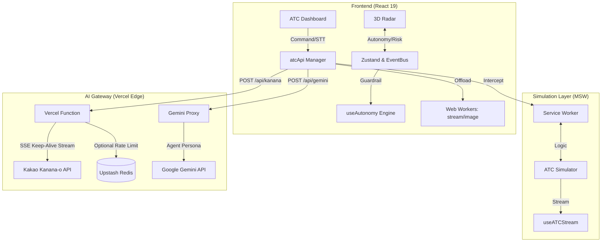

# 🛰️ Kanana ATC (Agent Traffic Control)

<p align="center">
  
  
  
  
  
  
</p>

> **"LLM의 예측 불가능한(Non-deterministic) 추론 결과를 확정적 제어 명령으로 변환하는 다중 에이전트 관제 인터페이스 실증 프로젝트"**
> 본 프로젝트는 Kanana-o 기반 멀티 에이전트 관제 UI/스트리밍 파이프라인을 실증하기 위한 개인 기술 프로젝트입니다.

---

## 💡 Background & Design Goals

기존의 관제 시스템은 모니터링 대상이 늘어날수록 관제사의 인지 부하가 급증하는 한계가 있습니다. 본 프로젝트는 **"상위 AI가 하위 AI들을 효과적으로 통제하고 지휘할 수 있는가?"** 라는 질문에서 시작하여, 다음과 같은 설계 목표를 검증합니다.

* **에이전트 간 계층적 지휘 체계 실증**: 지휘관 모델(Kanana-o)이 현장 모델(Gemini)들의 보고를 취합하여, **하위 AI의 행동 지침과 작동 모드를 실시간으로 결정 및 통제**할 수 있는가?
* **제어의 확정성 확보**: 가변적인 LLM의 추론 결과물을 시스템이 즉각 실행 가능한 확정적 명령(Deterministic Command)으로 안정적으로 변환할 수 있는가?
* **시스템 레벨 가드레일 설계**: AI의 오작동 감지 시, 수치화된 위험 지수(Risk Score)에 따라 제어권을 즉시 인간 관제사에게 이양(Handover)하는 안전 장치가 유효한가?

---

## 🛠️ System Architecture & Logic

### 1. 🔄 실시간 데이터 동기화 및 워커 기반 스트림 핸들러
* **Web Worker Architecture**: 3D 관제 레이더(Three.js)의 렌더링 프레임 드랍을 방지하기 위해, 무거운 SSE 스트림 파싱(`streamWorker.ts`)과 이미지 처리(`imageWorker.ts`)를 메인 스레드에서 분리하여 백그라운드 스레드(Web Worker)에서 전담 처리합니다.
* **Field Locking Mechanism**: 에이전트 속성 변경 시, 네트워크 지연으로 인한 UI 롤백 현상을 방지하기 위해 5초간 클라이언트 입력값을 강제 유지(Optimistic UI)합니다.
* **Offline Action Sync**: 네트워크 단절 시 제어 명령을 **IndexedDB에 큐잉**하고 복구 시 자동 동기화합니다.

### 2. 🧠 LLM Command Pipeline (`Kanana-o AI`)
* **Cognitive Structure**: 프롬프트 체인을 통해 모든 응답이 `<THOUGHT>`, `<PREDICTION>`, `<REPORT>` 과정을 거치도록 강제하여 의사결정의 투명성을 확보했습니다.
* **Prediction Guardrail**: AI가 예측 과정(`<PREDICTION>`)을 건너뛸 경우, UI에 경고 로그(`AI_WARN`)를 띄워 관제사가 상황을 인지할 수 있도록 설계했습니다.
* **Fuzzy Target Matching**: LLM이 타겟 이름을 혼용하거나 오타를 내는 현상을 방어하기 위해 **레벤슈타인 거리(Levenshtein Distance)** 기반의 퍼지 매칭 알고리즘을 도입했습니다.
* **Robust Regex Fallback**: 오디오 모드 활성화 시 JSON 포맷을 무시하고 평문과 섞여 나오는 응답 구조에서 데이터를 추출할 수 있는 자체 파싱을 구현했습니다.

### 3. 🛡️ 제어권 및 데이터 보호 (Safety & Security)
* **Vision & OCR Data Masking**: 사용자가 첨부한 관제 화면이나 문서에서 Tesseract.js를 이용해 텍스트를 추출하고, 주민번호나 전화번호 같은 민감정보(PII)를 정규식 필터(`privacyFilter.ts`)로 사전에 형태를 보존하며 부분 마스킹(`*`) 처리하여 AI 전송을 차단합니다.
* **Prompt Injection Defense**: 입력 문자열의 공백과 제어 문자를 제거한 뒤 악성 패턴을 검사하여 우회 시도(예: `i g n o r e`)를 원천 차단합니다.
* **Security & Resilience**: Vercel Edge Function TTFB 타임아웃 우회를 위한 **SSE Fake Keep-Alive Streaming** 기법을 적용하여 장기 추론을 지원합니다. JWT 기반 인증 로직을 포함하며(엔드포인트별로 선택 적용), API Key는 브라우저 내에서 암호화 저장 후 요청 시 헤더로 전달됩니다(서버 저장 없음).

### 4. 🔗 계층형 에이전트 지휘 구조 (AI-to-AI Control)
* **Kanana-o (중앙 지휘)**: 수집된 로그와 리스크 스코어를 종합하여 하위 노드(Gemini)에 대해 확정적 지시(`PAUSE`, `PRIORITY_HIGH` 등)를 내립니다.
* **Gemini (현장 노드)**: 현장 데이터를 분석해 보고하며, Kanana-o의 지시에 따라 모드를 전환하며 능동적인 대응 전략을 제시합니다.

---

## 📊 Operational Interface (UI/UX)

* **Interactive Onboarding (Joyride)**: 최초 접속 사용자를 위해 시스템의 핵심 기능(3D 레이더, AI 자율 모드, 커맨드 센터 등)을 단계별로 안내하는 인터랙티브 가이드를 제공합니다.
* **Tactical Radar (3D)**: Three.js 기반 입체 관제 뷰. 부드러운 트래킹과 주요 기체에 대한 시각적 강조 효과를 지원합니다.
* **Command Center (STT)**: **Web Speech API** 기반 음성 명령을 지원하며, AI의 추론 프로세스 활성화 상태를 실시간 시각화합니다.
* **Semantic Audio Insight**: 파형 설계를 통해 화면을 보지 않고도 시스템 상태 변화를 청각적으로 인지합니다.

---

## 🎬 Demo Scenarios

### Scenario 1: 계층형 위기 대응 (Hierarchical Response)
* **동작:** 사고 상황 데이터를 첨부하여 해결을 요청합니다.
* **결과:** 현장 노드가 위협을 식별해 보고하면, 중앙 관제가 이를 판단해 하위 에이전트들을 격리하거나 정지시키는 등의 지휘 명령을 하달합니다.

### Scenario 2: 자율 관제 및 음성 브리핑 (Agentic Workflow)
* **동작:** 트래픽 과부하 상황에서 오토파일럿(Autopilot) 모드를 활성화합니다.
* **결과:** Kanana API의 PCM 오디오 스트림 브리핑과 함께 (배포 환경에서는 Vercel 타임아웃 방지를 위해 브라우저 내장 TTS 브리핑으로 대체됨), AI가 자원 분배 명령(`SCALE`, `TRANSFER`)을 직접 수행합니다.

### Scenario 3: 보안 가드레일 검증 (Safety Shield)
* **동작:** 민감 정보 입력 시도 또는 시스템 임계치 초과 상황을 연출합니다.
* **결과:** 내부 필터가 PII를 마스킹하고, 위험 지수 초과 시 AI의 제어권을 즉시 제한하고 경고를 발생시킵니다.

---

## 🏗️ Architecture



---

## 📦 Installation & Deployment

### Local Development
```bash
git clone https://github.com/209512/kanana-atc.git
cd kanana-atc
npm install
npm run dev

# (Optional) Run Vercel Edge functions locally (http://127.0.0.1:3000)
npm run vercel-dev
```
> **Note**: 별도의 환경변수 없이 실행 가능합니다. API Key는 UI 상단의 **[CONNECT WITH AI]** 메뉴에서 입력하면 브라우저 내부에서 AES-GCM으로 암호화 보관됩니다.
>
> MSW(Service Worker)는 기본 활성화되며 `/api/stream` 등 시뮬레이션 엔드포인트를 모킹합니다. `/api/init`은 키가 없으면 MSW가 `200 { token:null }`로 응답하고, 키가 있으면 passthrough 됩니다. `/api/kanana`는 기본 passthrough 입니다.

### Security / Audit
```bash
# Prod-only (deploy impact)
npm run audit:prod

# Full tree (includes dev tooling)
npm run audit:all
```

### 🚀 Vercel Deployment
이 프로젝트는 **환경변수를 입력하지 않고 Vercel에 즉시 배포할 수 있도록 최적화**되어 있습니다.
- 로컬 환경에서는 **PCM 오디오 재생을 우선** 사용하며, 브라우저/권한/환경에 따라 폴백될 수 있습니다. Vercel 배포 환경에서는 5MB Payload 제한과 타임아웃을 피하기 위해 **텍스트 브리핑 + 브라우저 내장 TTS** 모드로 우회(Fallback) 전환됩니다.

---

## ⚠️ Limitations & Technical Trade-offs

### 1) Vercel Edge Runtime 제약과 대응
* **제약**: Vercel Edge 환경에서는 실행 시간/페이로드/네트워크 타임아웃 제약이 있어, 고용량 응답(예: 오디오 포함) 처리에 제한이 생길 수 있습니다.
* **대응**: 배포 환경에서는 PCM 오디오 대신 **텍스트 브리핑 + 브라우저 내장 TTS 폴백**으로 전환하여 안정적인 동작을 우선합니다.

### 2) MSW 기반 시뮬레이션(하이브리드)
* **운영 방식**: MSW(Service Worker)는 개발/배포 환경 모두에서 기본 활성화됩니다.
* **데이터 흐름**: `/api/stream` 등 시뮬레이션 엔드포인트는 모킹되며, `/api/kanana` 같은 AI Gateway는 **passthrough**로 처리됩니다(설정에 따라 실제 추론/프록시 호출 가능).

### 3) Stateless 운영 구조의 특성
* **설계 배경**: 서버 세션을 저장하지 않는 구조를 채택해, Edge 환경에서도 일관된 동작을 목표로 합니다.
* **운영 고려사항**: 인증/레이트리밋/토큰 폐기 정책은 환경 구성(예: Redis/KV 설정)에 따라 강도와 일관성이 달라질 수 있습니다.

---

## 🚀 Next Improvements (Roadmap)

### 1) 추론 효율 및 비용 대응
* **입력 전처리**: 로그/상태를 그대로 보내기보다, 핵심 이벤트 추출/요약 후 전송하는 방식으로 입력 크기(토큰)를 줄일 수 있습니다.
* **조기 종료(Early Exit)**: 저위험 상황에서는 추론 단계를 줄이거나 중단하는 정책을 강화할 수 있습니다.

### 2) 모델 운영 전략
* **상황 기반 모델 선택**: 평시(저비용)와 위기 상황(고정확도)에 따라 모델 선택 정책을 분리할 수 있습니다.
* **컨텍스트 캐싱**: 유사 상황에서 중간 산출물(요약, 후보 액션 등)을 재사용하는 캐싱 전략을 도입할 수 있습니다.

### 3) Cost / Quota Considerations
* 현재는 베타 제공 정책을 기준으로 설계되어 있으며, 제공 방식/과금 정책은 추후 변경될 수 있습니다.
* 과금이 토큰 기반으로 전환되는 경우를 대비해, 입력 토큰을 줄이기 위한 전처리(요약/필터링), 단계적 추론(멀티스텝), 캐싱, 모델 스위칭 같은 전략을 적용하는 방향이 합리적입니다.

### 🧪 Testing
Playwright(E2E)와 Vitest를 기반으로 주요 아키텍처 검증을 위한 자동화 테스트 인프라가 구축되어 있습니다.
```bash
# E2E Test (Vercel TTFB 타임아웃 및 SSE 스트림 검증)
npm run test:e2e
```

---

## 🛠️ Technical Stack

| Component | Technology | Description |
| --- | --- | --- |
| **Frontend** | React 19, TypeScript, Vite, Tailwind CSS, Zustand, React-Joyride | Modern UI & High-speed bundling |
| **3D Rendering** | Three.js, React Three Fiber, React Three Drei | Tactical 3D drone radar visualization |
| **AI Engine** | Kakao Kanana-o | Strategic decision & PCM Audio briefing |
| **Simulation** | MSW 2.x | Zero-infra distributed logic simulation |
| **Infrastructure** | Vercel | Edge Functions (API proxy) |

---

## 📝 Design Rationale
본 프로젝트는 비결정적인 LLM의 판단을 실제 시스템 명령으로 안정적으로 전환하고, 상위 AI가 하위 에이전트들을 통제하는 '계층형 AI 지휘 체계'의 가능성을 탐구합니다. 단순한 대화형 AI를 넘어, 가드레일 하에서 AI가 직접 '행동'하고 '책임'질 수 있는 시스템 아키텍처를 제시하고자 했습니다.

---

## 📝 License
Copyright 2026 **209512**. Licensed under the **Apache License, Version 2.0**.
